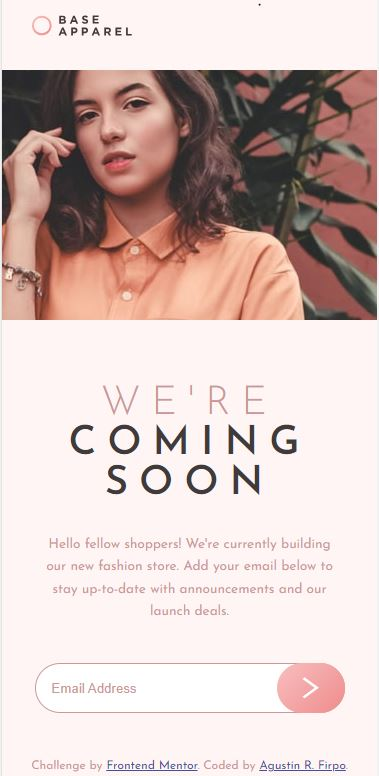
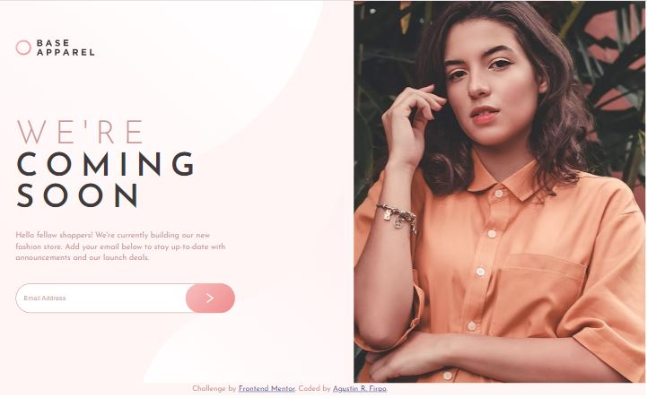
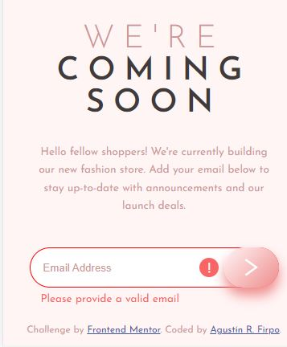
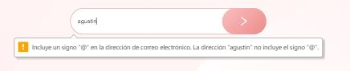
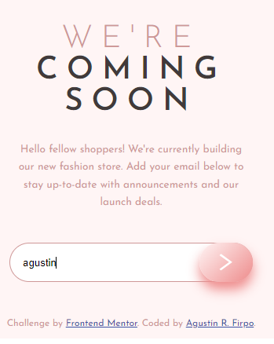

# Frontend Mentor - Base Apparel coming soon page solution

This is a solution to the [Base Apparel coming soon page challenge on Frontend Mentor](https://www.frontendmentor.io/challenges/base-apparel-coming-soon-page-5d46b47f8db8a7063f9331a0). Frontend Mentor challenges help you improve your coding skills by building realistic projects.

## Table of contents

- [Overview](#overview)
  - [The challenge](#the-challenge)
  - [Screenshot](#screenshot)
  - [Links](#links)
- [My process](#my-process)
  - [Built with](#built-with)
  - [What I learned](#what-i-learned)
  - [Continued development](#continued-development)
  - [Useful resources](#useful-resources)
- [Author](#author)
- [Acknowledgments](#acknowledgments)

## Overview

### The challenge

Users should be able to:

- View the optimal layout for the site depending on their device's screen size
- See hover states for all interactive elements on the page
- Receive an error message when the `form` is submitted if:
  - The `input` field is empty
  - The email address is not formatted correctly

### Screenshot

### Links

- Solution URL: [Solution Repository-Github](https://github.com/Arfirpo/base-apparel-coming-soon-master)
- Live Site URL: [Solution Page](https://arfirpo.github.io/base-apparel-coming-soon-master/)

## My process

### Built with

- Semantic HTML5 markup
- HTML5 forms
- CSS custom properties
- Flexbox
- Mobile-first workflow
- Javascript
- Regular Expressions (js)

### What I learned

This challenge served me mainly to learn how to validate forms with javascript.
In that sense, I had a first approach to the functioning of regular expressions, incorporating tools such as the "test" method, modifying styles of css from js, among other things.

### Continued development

In the future I would like to reinforce the concepts learned with this challenge and continue to expand my handling of both javascript and form creation in html and css.

### Useful resources

- [Regexr](https://regexr.com/) -This page provided me with a regular expression to validate the emails in my code.

## Author

- [Linkedin](https://www.linkedin.com/in/agustin-rodrigo-firpo-0aa86697/)
- [@Arfirpo](https://www.frontendmentor.io/profile/Arfirpo)

## Acknowledgments

- [COdingTube](https://www.youtube.com/CodingTube) - This YouTube channel is very recomenadable to learn web development and was very useful for me in the realization of this challenge.
